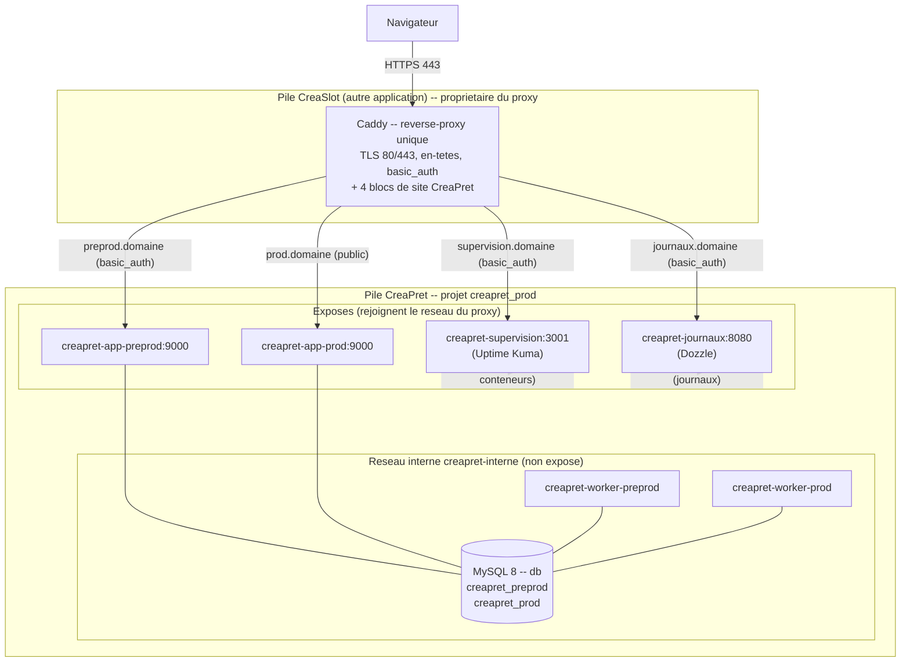

# Architecture de déploiement — CréaPrêt

Ce document explique **pourquoi** l'infrastructure de CréaPrêt est agencée ainsi (choix et alternatives
écartées). Le **comment** (procédures de déploiement, d'exploitation, de sauvegarde) est décrit dans
`docs/runbook-deploiement.md`, auquel ce document renvoie sans le dupliquer.

**Particularité majeure** : contrairement à une pile autonome, CréaPrêt **partage le reverse-proxy**
d'une autre application hébergée sur le même serveur. C'est le fil conducteur de la plupart des choix.

---

## 1. Contexte et contraintes

Un **serveur unique** héberge **deux applications** : CreaSlot (déjà déployée) et CréaPrêt. Le
**reverse-proxy (Caddy) appartient à CreaSlot** et **détient les ports standards 80/443**. Aucune
seconde instance de proxy ne pouvait les prendre : deux processus ne peuvent pas écouter le même port.

**Options envisagées** :

| Option | Principe | Écartée / retenue |
|---|---|---|
| **A — Étendre la composition existante** | Ajouter les services CréaPrêt dans le `compose.prod.yml` de CreaSlot, un seul projet | **Écartée** : couple les deux applications dans un même dépôt et une même composition ; un redéploiement touche l'ensemble ; contredit des dépôts distincts. |
| **B — Pile séparée rejoignant le réseau du proxy** | CréaPrêt a sa propre composition et rejoint le réseau (external) du proxy, qui expose ses domaines | **Retenue**. |
| **C — Proxy « chapeau » devant deux piles** | Un troisième proxy en façade multiplexe vers deux piles Caddy internes | **Écartée** : surcouche disproportionnée pour deux applications, second point de terminaison TLS à maintenir. |

**Justification du choix B** : il offre des **cycles de déploiement indépendants** pour des **dépôts
distincts** (chaque application build, teste et déploie sa propre image, sans coordination) — au prix
d'un **point d'entrée partagé** (le proxy de CreaSlot), assumé et documenté (§9). CréaPrêt n'embarque
donc **pas** de service `caddy` ; il apporte le reste de sa pile (base dédiée, deux services
applicatifs, deux consommateurs, supervision, consultation des journaux) et se raccorde au réseau du
proxy.

---

## 2. Vue d'ensemble

Schéma source : `docs/diagrammes/architecture-deploiement.mermaid`.

**Quatre domaines** sont exposés (les deux applications, la supervision, les journaux) ; la base et les
deux consommateurs ne le sont pas. Orchestration : `compose.prod.yml` (projet `creapret_prod`), 7
services, deux réseaux.

---

## 3. Couches et responsabilités

| Élément | Fait | Ne fait pas |
|---|---|---|
| **Caddy** (pile CreaSlot) | Terminaison TLS, routage par domaine vers les services CréaPrêt, `basic_auth` des accès non publics, service des assets statiques | N'héberge pas le code de CréaPrêt ; ne pose **pas** la CSP (nonce dynamique, cf. ci-dessous) |
| **`creapret-app-*`** (php-fpm) | Sert l'application ; **pose les en-têtes de sécurité applicatifs** | Ne sert pas les statiques directement (délégués au proxy) ; ne joue pas les migrations au démarrage (§5) |
| **`creapret-worker-*`** | Consomme la file Messenger (`async`) → envoi des courriels hors cycle requête | Ne sert aucune page (non exposé) |
| **`db`** (MySQL) | Deux bases isolées + deux utilisateurs cloisonnés | N'est jamais exposée (réseau interne seul, §4) |
| **`creapret-supervision`** (Uptime Kuma) | Sonde les domaines et l'état des conteneurs (socket Docker `:ro`) | Ne peut signaler sa propre panne (§9) |
| **`creapret-journaux`** (Dozzle) | Consultation des journaux, **filtrée par projet** | N'expose que les conteneurs de CréaPrêt (label de projet Compose) |

### Répartition des en-têtes de sécurité — un seul point de vérité par en-tête

**Principe** : la **politique de contenu (CSP)** et le **transport sécurisé strict (HSTS)** sont posés
**par l'application** (`SecuriteEnTetesListener`), qui est aussi la source de `X-Frame-Options`,
`X-Content-Type-Options` et `Referrer-Policy`. **Pourquoi côté application** : la CSP porte un **nonce
qui change à chaque requête** — un en-tête **statique** de proxy ne peut pas le porter ; poser la CSP en
un seul endroit (l'app) garantit que le nonce annoncé correspond aux scripts inline.

Le **proxy** n'ajoute alors **que ce que l'application ne peut pas poser** au bon niveau :
`Permissions-Policy`, masquage de l'en-tête `Server`, et le cache `immutable` des assets versionnés
qu'il sert lui-même. **Objectif : un seul point de vérité par en-tête**, pour éviter qu'un en-tête soit
défini à deux endroits avec des valeurs divergentes.

> **Réconciliation nécessaire (point de configuration)** : le snippet d'en-têtes **générique** de
> CreaSlot pose également HSTS / `X-Frame-Options` / `nosniff` / `Referrer-Policy`. Comme la directive
> `header` de Caddy **remplace**, ces en-têtes proviendraient alors du proxy et **non** de l'application
> — rompant le « point de vérité unique ». Les **blocs de site de CréaPrêt** doivent donc importer un
> snippet **réduit** (Permissions-Policy + masquage `Server` + cache assets uniquement), en **laissant
> l'application** poser CSP, HSTS et les en-têtes de cadre/contenu. Ce réglage vit dans le dépôt de
> CreaSlot (§9).

---

## 4. Réseaux et cloisonnement

**Deux réseaux** (`compose.prod.yml`) :

- **`creapret-interne`** (bridge, privé) : `db` ↔ services applicatifs et consommateurs. **La base n'est
  joignable que là** ; elle n'est sur aucun autre réseau.
- **`proxy`** (déclaré **external**, `name: creaslot_prod_creaslot-prod-net`) : partagé avec la pile
  CreaSlot ; **seuls** les services devant être joints par Caddy s'y connectent (`creapret-app-*`,
  `creapret-supervision`, `creapret-journaux`).

**Aucun port n'est publié** par la pile CréaPrêt : le proxy est l'unique point d'entrée. La base, sans
port hôte et hors du réseau partagé, est **inatteignable depuis l'extérieur**.

### Pourquoi les noms de services sont préfixés `creapret-`

Sur un réseau Docker, chaque conteneur est **joignable sous le nom de son service** (résolution DNS
interne). Sur le **réseau partagé**, deux applications déclarant des services **homonymes**
(`app-preprod`, `app-prod`) rendraient la résolution **ambiguë dans les deux sens** : le proxy de
CreaSlot pourrait atteindre l'application CréaPrêt à la place de la sienne, et réciproquement. Un **alias
réseau ne suffit pas** — il est **additif** (il n'efface pas le nom de service). Seul un **nom de service
unique** (`creapret-app-preprod`, `creapret-app-prod`, `creapret-worker-*`, `creapret-supervision`,
`creapret-journaux`) supprime la collision : c'est le nom de service qui détermine la résolution.

---

## 5. Cycle de vie d'une version

De l'intégration à la mise en ligne (le détail opérationnel est dans `docs/runbook-deploiement.md` §4) :

1. **Construction de l'image**, étiquetée par l'**empreinte du commit** (`ghcr.io/sgahovey/creapret:<sha>`),
   par le workflow réutilisable `build-push.yml`. Un SHA = une image immuable et traçable ; la **même**
   image sert les services `app-*` et `worker-*` (*build-once*).
2. **Publication** sur le registre GHCR (jeton fourni par GitHub, cache de build `type=gha`).
3. **Préproduction** : déployée **automatiquement** sur poussée de la branche `preprod`.
4. **Production** : déployée sur **décision explicite** (`workflow_dispatch`) **avec approbation
   manuelle** (environnement GitHub protégé) — jamais sur un simple merge.

### Pourquoi les migrations relèvent du déploiement, et non du démarrage du conteneur

Les migrations sont jouées par l'**étape de déploiement** (`deploy-ci.sh`), sur **un seul** service
applicatif, **pas** dans l'`ENTRYPOINT` du conteneur. Trois raisons :
- l'image étant **partagée** par l'application et le consommateur, migrer au démarrage lancerait **deux
  migrateurs concurrents** sur la même base (course) ;
- un conteneur qui **redémarre** ne doit pas **rejouer** le schéma ;
- une migration **en échec** doit **interrompre le déploiement** (signal clair), plutôt que faire tomber
  le service en **boucle de redémarrage**.

L'`ENTRYPOINT` se limite donc à **resynchroniser les assets** (`public/` → volume servi par le proxy) ;
le préchauffage du cache est fait **au build**.

---

## 6. Données

**Décision** : une base **dédiée** à CréaPrêt (service `db` propre, bases `creapret_preprod` et
`creapret_prod`, deux utilisateurs aux privilèges restreints à leur base), **plutôt qu'une base partagée**
avec l'autre application.

**Pourquoi** : au-delà du cloisonnement (le compromis d'une application n'expose pas l'autre),
**restaurer** une instance partagée supposerait de **manipuler celle qui sert une application en
production** — une restauration CréaPrêt toucherait la base de CreaSlot, et inversement. Une base dédiée
rend chaque restauration **sans effet de bord** sur l'autre application.

- **Volumes nommés** : `mysql_data_prod` (données MySQL), `assets_preprod` / `assets_prod` (assets
  compilés servis par le proxy), `creapret_supervision_data` (état de la supervision).
- **Sauvegarde et rétention** : dump cohérent horodaté et compressé, rétention paramétrable — mécanisme
  et procédure dans `docs/runbook-deploiement.md` §6 (avec l'incident de restauration croisée et son
  garde-fou).

---

## 7. Sécurité — ce qui protège quoi, à quel niveau

| Niveau | Mécanisme |
|---|---|
| **Transport** | Chiffrement TLS terminé par le proxy (HTTPS) ; HSTS posé par l'application (transport strict). |
| **Accès d'exploitation** | Clé SSH de déploiement **restreinte par commande forcée** (un seul script exécutable, arguments filtrés) ; `basic_auth` du proxy sur la préproduction, la supervision et les journaux (accès non publics). |
| **Cloisonnement réseau** | Base sur le **réseau interne seul**, **aucun port publié** ; services applicatifs seuls exposés, sous des **noms uniques** (§4). |
| **En-têtes applicatifs** | CSP **à nonce** (`script-src 'self' 'nonce-…'`, sans `unsafe-inline` ni `unsafe-eval`), `nosniff`, `X-Frame-Options`, `Referrer-Policy` — posés par l'application (§3). |
| **Habilitations** | Rôles cumulatifs (`ROLE_SUPER_ADMIN > ROLE_GESTIONNAIRE > ROLE_EMPRUNTEUR`) ; `access_control` + `#[IsGranted]` en défense ; **Voter** d'administration des comptes (garde anti-soi). |
| **Journalisation** | Journal d'administration *append-only* (décisions de prêt, actions de compte) + **déclencheur SQL** traçant les modifications sensibles de compte (rôle, activation). |

**Authentification des courriels sortants** : le domaine expéditeur est **authentifié auprès du routeur
de courriels** (enregistrements DNS d'expéditeur, signatures **DKIM**, politique **DMARC**), afin que les
messages transactionnels (confirmation de prêt, rappel d'échéance, alerte de retard) ne soient pas
rejetés ou marqués comme indésirables. Valeurs fournies par le routeur, hors de ce document.

---

## 8. Éco-conception (RGESN)

- **Ressources auto-hébergées** : Bootstrap, Stimulus/Turbo, FullCalendar, Chart.js, la police et les
  icônes sont **vendorisés** et servis par le proxy — **aucune dépendance à un CDN tiers** (pas de
  requête sortante vers un tiers, pas de traçage induit, robustesse hors-ligne).
- **Images de production sans dépendances de développement** (`composer install --no-dev`) : artefact
  plus léger, surface réduite.
- **Journalisation bornée** : logs Docker limités en taille et en nombre de fichiers (`max-size` /
  `max-file`) — pas de croissance non bornée du disque.
- **Consommation observée** : pile modeste (php-fpm + deux consommateurs légers + un petit MySQL + deux
  outils d'observabilité), cohérente avec un **démonstrateur à faible trafic**, **mutualisée** sur le
  même serveur que l'autre application — les ressources sont partagées, sans surdimensionnement.
- **Absence de collecte de métriques détaillées** : la supervision se limite à des **sondes d'état** et
  à des battements de tâches. Ce choix est **proportionné** au périmètre (démonstrateur pédagogique) :
  collecter et stocker des séries temporelles fines consommerait des ressources sans bénéfice à cette
  échelle.

---

## 9. Limites et évolutions

| Limite | Conséquence | Pour la lever |
|---|---|---|
| **Point d'entrée partagé** (proxy de CreaSlot) | Les deux applications sont **couplées** par le proxy : une panne ou une reconfiguration du proxy affecte les deux. | Introduire un proxy « chapeau » (option C) ou dédier un proxy à chaque application sur des ports distincts derrière un répartiteur. |
| **Configuration du proxy dans le dépôt de l'autre application** | Toute modification de bloc de site CréaPrêt se fait dans le dépôt CreaSlot ; réconciliation des en-têtes à y maintenir (§3). | Externaliser la configuration des sites (fichiers de config montés par application), ou passer à l'option C. |
| **Supervision incapable de signaler sa propre panne** | Si l'outil de supervision tombe, aucune alerte ne part, y compris la sienne. | Un contrôle externe (supervision tierce, ou page de statut consultée par un service distant). |
| **Absence de redondance et de bascule automatique** | Serveur unique : sa perte interrompt les deux applications ; pas de reprise automatique. | Réplication de la base et bascule (second serveur), sauvegardes copiées hors-serveur (aujourd'hui locales). |

---

## Références

| Fichier | Rôle |
|---|---|
| `compose.prod.yml` | Orchestration (projet `creapret_prod`), 7 services, 2 réseaux |
| `docker/app/entrypoint.sh` | Synchronisation `public/` → volume d'assets au démarrage |
| `docker/mysql/init-prod.sh` | Création des 2 bases + 2 utilisateurs au premier démarrage |
| `Dockerfile` | Image multi-stage de production |
| `.env.deploy.example` | Gabarit des variables d'infrastructure (sans valeurs) |
| `scripts/deploy-ci.sh` | Déploiement par commande forcée SSH (migrations sur un service) |
| `src/EventListener/SecuriteEnTetesListener.php` | En-têtes de sécurité applicatifs (CSP à nonce, HSTS…) |
| `docs/runbook-deploiement.md` | Procédures d'exploitation (le « comment ») |
| `docs/diagrammes/architecture-deploiement.mermaid` | Source du schéma (§2) |

---

*Architecture de déploiement CréaPrêt — le « pourquoi ». Le « comment » est dans
`docs/runbook-deploiement.md` ; la dette technique dans `docs/DETTE_TECHNIQUE.md`.*
