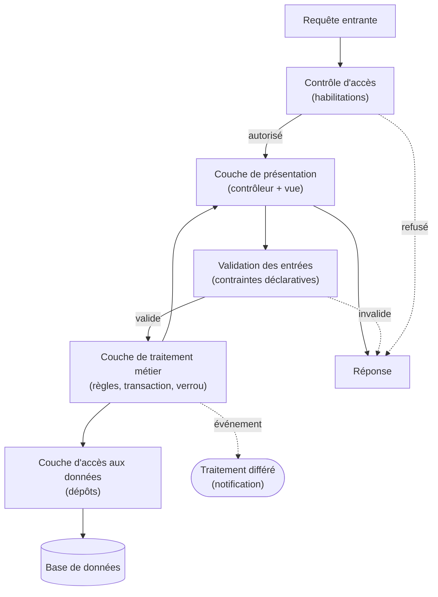

# Conception — Architecture en couches

> Pour un lecteur qui veut comprendre **comment l'application est organisée à l'intérieur** : quelles
> couches, qui a le droit d'appeler qui, et où vit chaque préoccupation. On parle de **couches** et de
> **mécanismes**, jamais de leur implémentation.

## Deux découpages complémentaires

- **Séparation présentation / traitement / données** (le découpage « en tiers ») : *ce qui est montré*
  est distinct de *ce qui décide* et de *ce qui est conservé*.
- **Couches de responsabilité** (le découpage interne) : **contrôleurs**, **services métier**, **accès
  aux données**, **modèle du domaine**.

## Les couches, leur rôle et leurs droits d'appel

| Couche | Rôle | A le droit d'appeler | N'a **pas** le droit |
|---|---|---|---|
| **Présentation** (contrôleur + vue) | Reçoit la requête, orchestre, restitue la réponse | La couche de traitement métier | Accéder directement aux données ; porter une règle de gestion |
| **Traitement métier** (services) | Porte les **règles de gestion** et les **transactions** | La couche d'accès aux données ; le modèle | Connaître la présentation (aucune notion de requête/réponse) |
| **Accès aux données** (dépôts) | Traduit un besoin en interrogation de la base | Le mécanisme de correspondance ; la base | Contenir une règle de gestion |
| **Modèle du domaine** (entités + énumérations) | Porte les données et les **invariants locaux** | — (rien) | Appeler une autre couche |

La règle est un **flux descendant strict** : présentation → traitement → accès aux données → modèle.
Une couche ne connaît **que celle du dessous**. Le modèle, tout en bas, **ne dépend de personne**.

## Où vit chaque préoccupation

- **Validation des entrées** — à la **frontière** : contraintes déclaratives sur les formulaires à
  l'entrée (couche de présentation), doublées des **invariants** portés par le modèle. Jamais dans les
  vues.
- **Règles de gestion** — dans la **couche de traitement**. C'est là que vit le **non-chevauchement**
  des prêts sur un exemplaire (RG-1), garanti par une **transaction** et un **verrou** ; là que se
  calcule la **disponibilité** (RG-4) et que s'appliquent les **transitions de statut**.
- **Habilitations** — un mécanisme de **gardiens d'autorisation**, consulté par la présentation
  **avant** d'agir : « cet utilisateur a-t-il le droit de valider ce prêt ? ».
- **Persistance** — dans la **couche d'accès aux données** exclusivement.
- **Notification** — **initiée** par la couche de traitement (un événement métier), mais **exécutée en
  différé** par un composant asynchrone, afin de ne pas retarder la réponse.

## Circulation d'une requête

De l'arrivée à la réponse : la requête passe d'abord le **contrôle d'accès** ; le **contrôleur**
orchestre ; les entrées sont **validées** ; le **service** applique les règles au sein d'une
transaction (verrou si nécessaire) ; l'**accès aux données** lit ou écrit dans la base ; un éventuel
**événement** part vers un traitement différé ; la réponse remonte. Un refus d'accès ou une entrée
invalide court-circuite vers la réponse.

## Justification : pourquoi, ce que ça protège, ce que ça coûte

**Pourquoi cette séparation.** Chaque couche a **une** responsabilité et **un** vocabulaire. Les
règles de gestion vivent en **un seul endroit**, indépendant de la manière dont on entre (interface,
tâche planifiée) et de la manière dont on stocke.

**Ce qu'elle protège.**

- Les **invariants métier** : une règle centralisée ne peut être contournée par un autre chemin.
- L'**intégrité des données** : seule la couche d'accès écrit, sous le contrôle des services.
- La **sécurité** : les habilitations forment un **point de passage** unique et vérifiable.
- La **testabilité** : on éprouve les règles **en isolation**, sans interface ni base réelle.

**Ce qu'elle coûte.** Une **indirection** supplémentaire (plus de composants, plus de fichiers), un
**passage de relais** entre couches, et la **discipline** de ne jamais court-circuiter le flux (par
exemple accéder aux données depuis la présentation). Ce coût est **assumé** : il achète la robustesse
et l'évolutivité.
