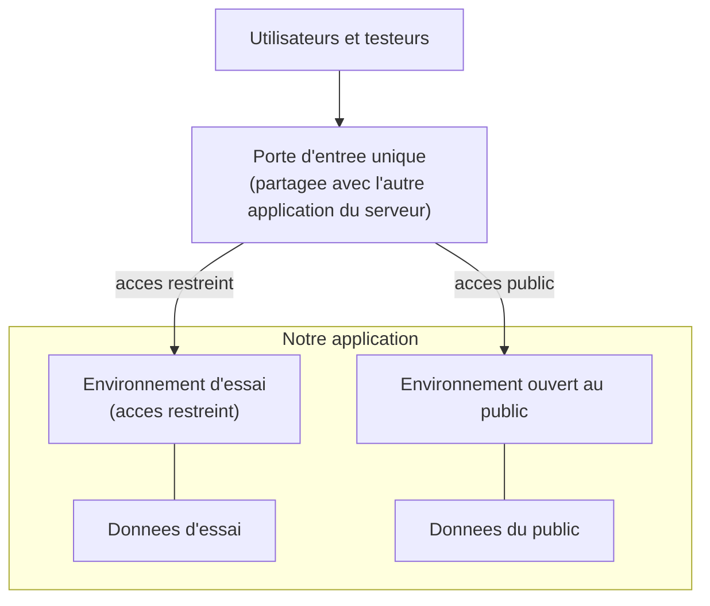

# Conception — Mise à disposition de l'application

> Pour un lecteur non technicien qui veut comprendre **ce que l'on cherche à obtenir** en matière de
> mise à disposition, et **pourquoi** telle orientation a été retenue. On y parle de besoins et de
> propriétés attendues, jamais de la manière de les réaliser.

## Le besoin

Deux environnements sont nécessaires :

- un **environnement d'essai**, à accès restreint, où l'on **valide** une nouvelle version avant de
  l'ouvrir aux utilisateurs ;
- un **environnement ouvert au public**, celui qu'utilisent réellement les emprunteurs et les
  gestionnaires.

On attend en outre trois propriétés :

1. **Livrer une nouvelle version sans interrompre le service** — la mise à jour ne doit pas se traduire
   par une coupure visible pour les utilisateurs.
2. **Pouvoir revenir en arrière** — si une version se révèle défaillante, on doit pouvoir rétablir
   rapidement la version précédente.
3. **Séparer les données** des deux environnements — ce qui se passe à l'essai ne doit jamais toucher
   les données du public, et réciproquement.

## Les contraintes

- **Une seule machine** est disponible.
- **Une autre application** y est déjà en service.
- Il n'existe **qu'un seul point d'entrée** possible depuis l'extérieur (une seule « porte » par
  laquelle les visiteurs arrivent), et cette porte est **déjà tenue par l'autre application**.

## Les options envisagées

| Option | Principe | Conséquence |
|---|---|---|
| **Tout mêler** à l'installation existante | Les deux applications ne forment plus qu'un ensemble | Une intervention sur l'une affecte l'autre ; les livraisons ne sont plus indépendantes. |
| **Installation distincte** réutilisant la porte commune | Notre application vit à part, mais entre par la même porte | Livraisons **indépendantes** ; en contrepartie, la porte reste **partagée**. |
| **Ajouter une seconde porte** devant les deux | Un aiguillage supplémentaire en amont | Complexité et point de défaillance en plus, sans bénéfice à cette échelle. |

## Le choix retenu et son coût

L'**installation distincte réutilisant la porte commune** est retenue : elle préserve des **cycles de
livraison indépendants** (on met à jour notre application sans coordination avec l'autre). Son **coût**
est double : la **porte d'entrée reste commune** (une panne de cette porte affecte les deux
applications), et le **réglage de l'aiguillage** vers notre application se fait du côté de l'autre.

## Schéma

Deux environnements derrière une porte d'entrée commune, avec des données séparées. Aucun composant
n'est nommé : seules les fonctions apparaissent.

