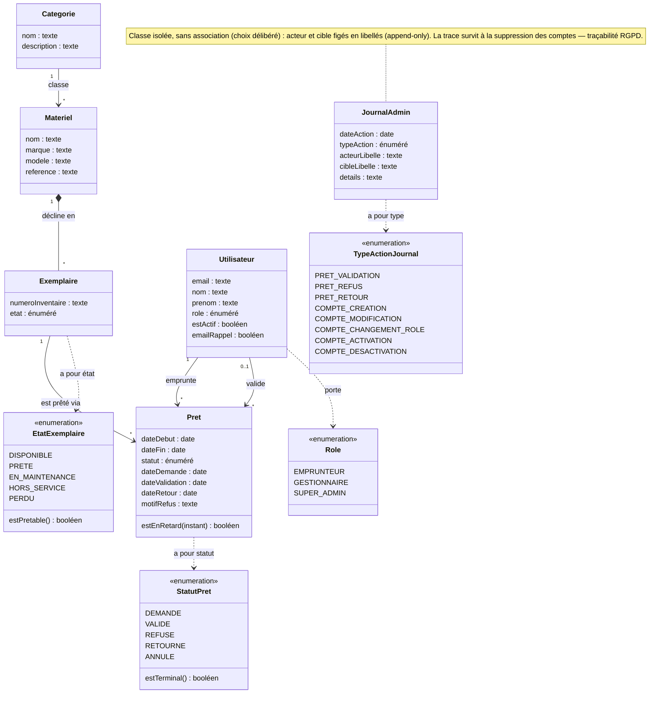

# Conception — Diagramme de classes du modèle métier

> Pour un lecteur qui veut comprendre **de quoi parle l'application** : les concepts du domaine du
> prêt de matériel, leurs liens, et où vivent les règles. On y raisonne en **concepts**, pas en
> tables ni en code. Les types sont **génériques** (texte, date, booléen, énuméré).

## Diagramme

## Légende

| Symbole / trait | Signification |
|---|---|
| Rectangle (classe) | Un concept du domaine |
| `«enumeration»` | Un ensemble **fermé** de valeurs possibles |
| `attribut : type` | Une donnée portée par la classe (type de domaine : texte, date, booléen, énuméré) |
| `méthode() type` | Une **question métier** à laquelle la classe sait répondre |
| Trait plein avec flèche (`-->`) | **Association** orientée (sens de lecture du libellé) |
| Losange plein (`*--`) | **Composition** : la partie n'existe pas sans le tout |
| Trait pointillé (`..>`) | **Dépendance** : la classe utilise un ensemble de valeurs |
| `1`, `*`, `0..1` | **Cardinalités** (un, plusieurs, au plus un) |

## Pourquoi ces classes

Le domaine se lit du plus général au plus concret : une **Catégorie** classe des **Matériels** ; un
Matériel se décline en **Exemplaires** physiques ; **c'est l'Exemplaire qui est prêté**, au travers
d'un **Prêt** qui relie un exemplaire à un **Utilisateur** emprunteur. Le **Journal
d'administration** enregistre les décisions de gestion.

- **Matériel** vs **Exemplaire** : distinction fondatrice. Le Matériel décrit un modèle (« tel
  ordinateur ») ; l'Exemplaire est l'unité réellement empruntable, avec son numéro d'inventaire et
  son état. Sans elle, on ne pourrait ni prêter deux unités du même modèle, ni suivre l'état de
  chacune.
- **Utilisateur** joue **deux rôles** dans un Prêt : celui qui **emprunte** et celui qui **valide**.
  D'où deux associations distinctes vers la même classe.
- **JournalAdmin** est **isolé** : il ne pointe vers personne. Ses libellés d'acteur et de cible sont
  figés au moment de l'écriture, afin que la trace subsiste même si le compte concerné disparaît.

## Pourquoi ces relations

- **Catégorie → Matériel** est une **association** de classement : un Matériel est un objet en soi,
  la Catégorie ne fait que le regrouper.
- **Matériel ◆→ Exemplaire** est une **composition** : un exemplaire n'a aucun sens sans le matériel
  dont il est une unité — sa **dépendance d'existence** est réelle. (La suppression est cependant
  **refusée** tant qu'il reste des exemplaires, plutôt que propagée — voir le modèle de données.)
- **Exemplaire → Prêt** et **Utilisateur → Prêt** sont des **associations** : le Prêt est un
  **événement** doté de son propre cycle de vie (son statut), qui référence un exemplaire et des
  personnes sans leur appartenir. Le validateur est **facultatif** (`0..1`) : une demande pas encore
  traitée n'en a pas.

## Où vivent les règles de gestion

Les **invariants locaux** — ceux qui ne dépendent que d'un objet — vivent dans les classes, sous
forme de **questions métier** :

- `Pret.estEnRetard(instant)` — ce prêt a-t-il dépassé son échéance ?
- `EtatExemplaire.estPretable()` — un exemplaire dans cet état peut-il être prêté ? (règle RG-2)
- `StatutPret.estTerminal()` — ce statut clôt-il le cycle de vie du prêt ?

Les **règles transversales** — celles qui mettent en jeu plusieurs objets ou la concurrence — **ne
sont pas** dans le modèle : elles vivent dans la **couche de traitement**. En particulier le
**non-chevauchement** de deux prêts actifs sur un même exemplaire (RG-1) et le calcul de
**disponibilité** (RG-4) exigent une transaction et un verrou ; les y placer serait un contresens.
Voir [`architecture-couches.md`](architecture-couches.md).

## Attributs volontairement omis

Un diagramme de classes n'est **pas** un schéma de tables. Ont été **écartés** de la représentation :

- les **identifiants techniques** (clés internes) et les **accesseurs triviaux** ;
- l'**empreinte du mot de passe** (donnée de sécurité, sans intérêt de domaine) ;
- les **horodatages techniques de notification** du prêt (mémorisent qu'un rappel/une alerte a été
  envoyé : bookkeeping, pas domaine) ;
- la **date de création** et les **métadonnées de consentement** de l'utilisateur (traitées au
  niveau du modèle de données, sous l'angle RGPD) ;
- les **identifiants dénormalisés** du journal (`acteur`/`cible` par identifiant) : seuls les
  **libellés** figés portent le sens.

*Le détail exhaustif des colonnes et des types figure dans [`modele-donnees.md`](modele-donnees.md).*
