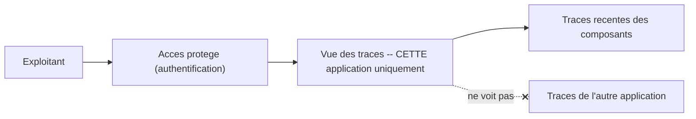

# Conception — Consultation des traces d'activité

> Pour un lecteur non technicien. Ce document précise un besoin **distinct** de la surveillance.

## Le besoin

La **surveillance** dit **QUE** quelque chose ne va pas. La **consultation des traces d'activité**
permet de comprendre **POURQUOI**. Quand un incident survient, il faut pouvoir relire ce que les
composants ont fait juste avant, pour en trouver la cause.

## Les exigences

- **Accéder aux traces sans ouvrir de session sur la machine** : le diagnostic doit se faire depuis une
  interface, sans manipulation technique directe du serveur.
- **Ne voir que ce qui concerne cette application** : les traces de l'autre application hébergée sur la
  même machine ne doivent **pas** apparaître (ni confusion, ni fuite d'informations la concernant).
- **Restreindre l'accès** : ces traces peuvent contenir des **informations sensibles** ; leur
  consultation doit être **protégée** et réservée aux personnes habilitées.

## Ce à quoi l'on renonce, et pourquoi

- **Conservation de longue durée** : on ne conserve que les traces **récentes**. Le besoin est le
  diagnostic **immédiat** d'un incident, pas l'analyse d'un passé lointain.
- **Recherche dans un historique profond** : coût et complexité disproportionnés au regard de l'usage
  d'un démonstrateur.
- **Corrélation entre plusieurs services** (rapprocher automatiquement des traces d'origines
  différentes) : utile à grande échelle, superflu ici.

Ces renoncements sont **assumés** : ils maintiennent un outil **simple**, suffisant pour comprendre un
incident récent.

## Schéma

Un accès protégé, une vue limitée aux traces de cette application.

