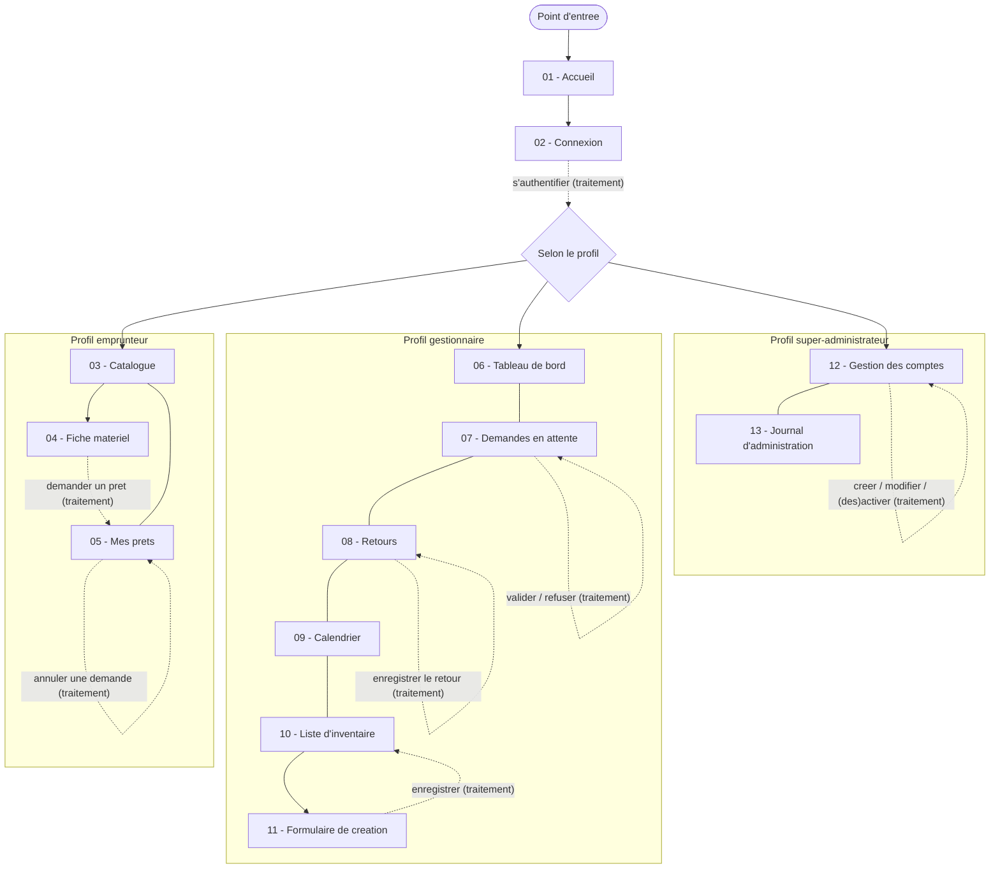

# Schéma d'enchaînement des écrans

> Pour un lecteur de conception. Ce schéma montre **comment on navigue** d'un écran à l'autre,
> par quelle action, et quelles transitions dépendent du profil. Il complète les maquettes
> (fichiers `01` à `13`) sans en reprendre le détail.

## Convention de lecture

- Les écrans sont **regroupés par profil**.
- **Flèche pleine** : navigation libre (simple consultation, aucun effet).
- **Flèche en pointillés avec libellé** : une **action qui déclenche un traitement**
  (par exemple demander un prêt, valider, enregistrer un retour).
- Les **numéros** renvoient aux maquettes correspondantes.
- Les profils sont **cumulatifs** : le gestionnaire accède aussi au catalogue ; le
  super-administrateur cumule les accès du gestionnaire.

## Diagramme

*Source versionnée à côté : [`enchainement.mermaid`](enchainement.mermaid).*
