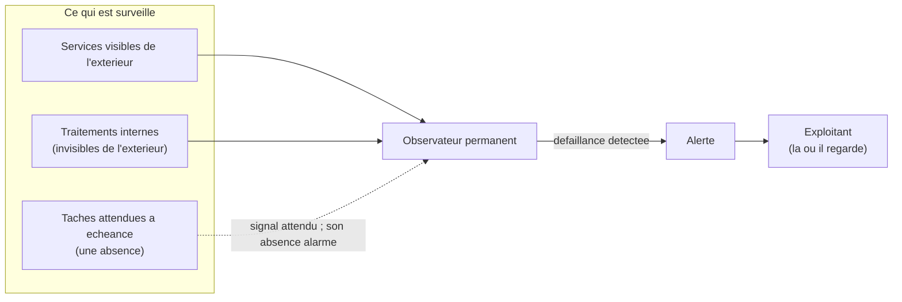

# Conception — Surveillance de la disponibilité

> Pour un lecteur non technicien qui veut comprendre **pourquoi** une surveillance est nécessaire et
> **ce qu'elle doit garantir**, indépendamment de la manière dont elle est réalisée.

## Le besoin

Savoir qu'un **service ne répond plus sans avoir à le vérifier soi-même**, et être **averti là où l'on
regarde** (le canal que l'exploitant consulte habituellement). Sans cela, une panne peut durer jusqu'à
ce qu'un utilisateur se plaigne — trop tard.

## Trois natures de défaillance

1. **Ce qui se voit immédiatement.** Un service ouvert au public cesse de répondre : il suffit de
   tenter d'y accéder pour le constater.
2. **Ce qui ne se voit pas**, parce que rien n'est visible de l'extérieur. Certains traitements
   internes ne présentent aucune page (par exemple l'**envoi des courriels**). S'ils s'arrêtent, **rien
   ne change en apparence** : le site répond toujours, mais plus aucun courriel ne part.
3. **Ce qui ne se voit jamais**, parce que cela **aurait dû se produire et ne s'est pas produit**. Une
   tâche périodique qui **ne s'exécute pas** ne laisse **aucun signe** : pas d'erreur, pas de message —
   seulement une **absence** (un rappel non envoyé, une sauvegarde non faite).

## Pourquoi la troisième est la plus dangereuse

On détecte une panne en **observant ce qui se passe**. Mais une absence ne se voit pas en observant :
il n'y a rien à observer. Pour la détecter, il faut **attendre un signal positif à échéance** et
**s'alarmer de son absence**. C'est un renversement : on ne surveille pas un évènement, on surveille le
**silence là où l'on attendait un signal**.

## Les exigences

- **Délai de détection** : l'indisponibilité d'un service ouvert au public doit être connue en **moins
  de deux minutes**, sans intervention humaine ; une tâche périodique qui ne s'exécute pas doit
  déclencher une alerte **peu après l'échéance attendue**.
- **Canal d'alerte** : l'alerte doit **parvenir à l'exploitant** sur un canal qu'il consulte, sans
  qu'il ait à aller la chercher.
- **Ce qui doit être surveillé** : les services rendus aux utilisateurs, les **traitements internes
  essentiels** (dont l'envoi des courriels), et l'**exécution effective des tâches périodiques**.
- **Ce qui ne le mérite pas** : les détails fins qui ne changeraient rien à une décision d'exploitation
  ; les surveiller ajouterait du bruit sans valeur.

## Schéma

Les trois natures d'éléments surveillés et le chemin d'une alerte jusqu'à l'exploitant.

