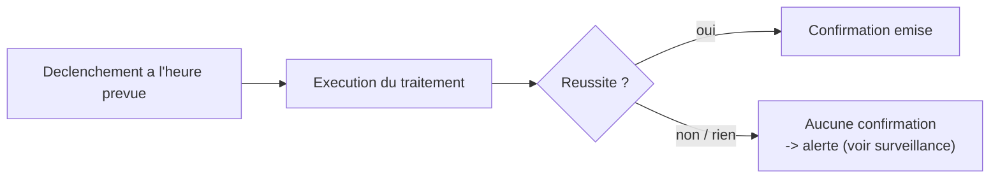

# Conception — Traitements automatiques

> Pour un lecteur non technicien. Décrit **trois traitements qui doivent s'exécuter seuls**, ce qu'ils
> apportent, et ce qu'exige chacun.

## Le besoin

Trois traitements doivent s'exécuter **sans intervention** :

1. **Prévenir les emprunteurs avant l'échéance et signaler les retards.** Cela relève du **service
   rendu** : un emprunteur prévenu à temps rend le matériel, un retard signalé est traité.
2. **Supprimer les traces d'audit au-delà de leur durée de conservation.** Cela relève d'une
   **obligation réglementaire**. Le principe de **limitation de la conservation** signifie qu'on ne
   garde des données personnelles **que le temps nécessaire**, puis qu'on les **efface** : les
   conserver indéfiniment serait une atteinte aux droits des personnes.
3. **Copier régulièrement les données pour pouvoir les rétablir après un incident.** Point essentiel :
   **une copie que l'on n'a jamais tenté de rétablir n'est pas une sauvegarde** — tant qu'une
   restauration n'a pas été **vérifiée**, on ne sait pas si la copie est exploitable.

## Les exigences, traitement par traitement

| Traitement | Fréquence attendue | Conséquence d'un échec | Délai acceptable avant de le savoir |
|---|---|---|---|
| Rappels et retards | Quotidienne | Un emprunteur non prévenu, un retard non signalé | Moins d'un jour |
| Effacement des traces échues | Périodique (mensuelle) | Conservation au-delà de la durée → non-conformité | Quelques jours |
| Copie de sauvegarde | Quotidienne | **Aucun point de restauration récent** en cas d'incident | Moins d'un jour (le plus critique) |

Un échec de l'un de ces traitements relevant souvent d'une **absence** (le traitement ne s'exécute
pas), sa détection relève de la **surveillance** (voir `../conception/surveillance.md`) : chaque
traitement doit **confirmer sa réussite**, et l'**absence de confirmation** doit alerter.

## Schéma

Le cycle d'un traitement, de son déclenchement à la confirmation de sa réussite.

