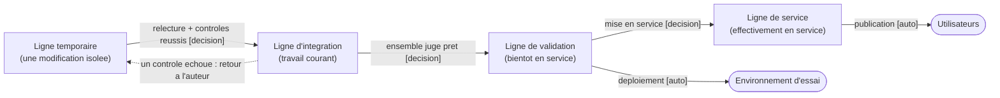

# Conception — Gestion des versions et cheminement d'une modification

> Pour un lecteur non technicien qui veut comprendre comment les évolutions de l'application seront
> **organisées** : comment plusieurs travaux avanceront **en parallèle sans se gêner**, comment on
> saura toujours **quelle version est en service** et comment y **revenir**, et pourquoi une
> modification n'atteindra les utilisateurs qu'**après vérification**. On y énonce des besoins et des
> règles, jamais une mise en œuvre.

## 1. Le besoin

Trois exigences guident toute l'organisation :

1. **Travailler en parallèle sans se gêner** — plusieurs modifications seront menées en même temps ;
   chacune doit pouvoir avancer sans perturber les autres ni le service en cours.
2. **Savoir et pouvoir revenir** — à tout moment on doit connaître **quelle version est en service**
   et pouvoir **rétablir rapidement** une version antérieure si la nouvelle se révèle défaillante.
3. **Vérifier avant d'exposer** — une modification ne doit atteindre les utilisateurs qu'**après**
   avoir été contrôlée et éprouvée.

## 2. Les lignes de développement

On retient **trois lignes** de développement permanentes, chacune avec un rôle distinct :

- **Ligne d'intégration** — elle rassemble le **travail courant**. On y verse les modifications au fur
  et à mesure ; leur ensemble n'y est pas encore forcément stable.
- **Ligne de validation** — elle représente **ce qui sera bientôt mis en service**. On y éprouve
  l'ensemble dans des conditions proches du réel, à accès restreint.
- **Ligne de service** — elle représente **ce qui est effectivement en service** à l'instant présent,
  entre les mains des utilisateurs.

**Pourquoi trois, et pas deux ni quatre.**

- **Deux ne suffiraient pas** : on mélangerait alors le travail encore instable avec ce qui est en
  service, et il n'existerait aucun palier intermédiaire pour **éprouver un ensemble cohérent** avant
  de l'ouvrir au public.
- **Quatre alourdiraient sans bénéfice** à cette échelle : chaque ligne supplémentaire ajoute une
  recopie et une synchronisation de plus, pour un gain nul ici.
- **Trois** est le minimum qui sépare clairement **ce que l'on écrit**, **ce que l'on s'apprête à
  ouvrir**, et **ce qui est déjà ouvert**.

**La modification isolée.** Une modification identifiable ne s'écrit jamais directement sur ces trois
lignes : elle vit d'abord sur sa **propre ligne temporaire**, créée pour elle et supprimée une fois
son travail intégré. Ainsi un travail inachevé ne se mêle jamais à celui des autres.

## 3. Le cheminement d'une modification

De son écriture jusqu'à sa mise à disposition, une modification franchit quatre étapes :

1. **Écriture** — sur sa ligne temporaire dédiée, à l'écart des autres travaux.
2. **Intégration** — la modification est **proposée** à la ligne d'intégration. Elle n'y est versée
   qu'après une **relecture** et des **contrôles** réussis. *Ce qui déclenche l'étape suivante* : une
   relecture qui approuve **et** des contrôles au vert. *Ce qui l'interrompt* : un contrôle en échec
   ou une relecture qui refuse — la modification retourne alors à son auteur.
3. **Validation** — lorsque la ligne d'intégration est jugée prête, son contenu rejoint la ligne de
   validation ; l'ensemble est alors **déployé automatiquement** dans l'environnement d'essai, où on
   l'éprouve. *Ce qui l'interrompt* : une anomalie constatée à l'essai renvoie au travail.
4. **Mise en service** — l'ouverture au public reste une **décision**, jamais automatique. Une fois
   cette décision prise, la **publication elle-même se déroule sans intervention manuelle**.

**Automatique ou décision — la distinction est centrale :**

- Se déclenchent **automatiquement** : les contrôles, le déploiement dans l'environnement d'essai, et
  la publication une fois la mise en service décidée.
- Restent une **décision humaine** : l'intégration d'une modification (après relecture) et surtout la
  **mise en service**, qui n'est jamais provoquée par un simple enchaînement technique.

## 4. Les points de vérification

**Avant qu'une modification soit intégrée**, on contrôle que :

- la forme du code est **conforme aux règles communes** ;
- une **analyse automatique** ne signale aucun défaut ;
- l'ensemble des **tests** passe ;
- une **relecture humaine** approuve la modification.

**Avant une mise en service**, on contrôle que :

- ce qui est en validation a été **éprouvé** dans un environnement proche du réel ;
- un **contrôle de bon fonctionnement après publication** est prévu : si l'application ne répond plus,
  on le sait immédiatement.

**Ce qu'on refuse de laisser passer** : une modification dont les contrôles échouent, qui n'a pas été
relue, ou qui **dégrade la qualité de ce qui existe déjà**.

## 5. La désignation des versions

**Le besoin.** Chaque état de l'application possède un **identifiant technique interne**, long et
illisible, impropre à la communication et à la comparaison. On veut pouvoir **nommer un état
autrement** : par un **nom court, parlant et comparable** d'une version à l'autre.

**La règle retenue.** Un numéro à **trois positions** séparées par des points. Chaque position a un
sens précis :

- **1ʳᵉ position** — une évolution **incompatible** : quelque chose qui existait change de manière
  visible pour l'utilisateur ou pour ce qui s'appuie sur l'application.
- **2ᵉ position** — un **ajout compatible** : une nouvelle possibilité, sans rien casser de l'existant.
- **3ᵉ position** — une **correction** : aucun ajout, un défaut corrigé.

**Le moment où l'on incrémente.** Le numéro est **fixé au moment où un état est désigné pour la mise
en service** : on fige alors un **nom stable**, attaché à cet état précis, qui permettra plus tard de
le **retrouver** et, au besoin, d'y **revenir**.

## 6. Schéma

Le cheminement d'une modification, de sa ligne temporaire jusqu'à la mise en service. Aucun outil
n'est nommé : seules les lignes, les étapes et la nature des passages (automatique ou décision)
apparaissent.

