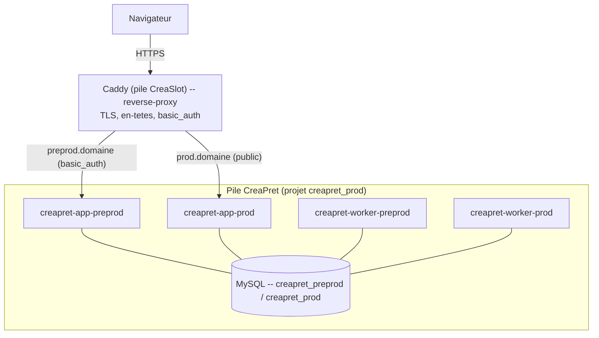

# Réalisation — Mise à disposition de l'application

> Pour un lecteur technique. **Conception correspondante** : `../conception/deploiement.md`. Ce document
> synthétise **ce qui a été mis en place** ; il ne recopie pas les documents détaillés.

## Ce qui a été mis en place

- **Pile séparée** (`compose.prod.yml`, projet `creapret_prod`) qui **rejoint le réseau du proxy
  existant** (déclaré *external* : `creaslot_prod_creaslot-prod-net`). Le proxy **Caddy** appartient à
  l'autre application (CreaSlot) et reste l'**unique point d'entrée**.
- **Deux environnements** : services applicatifs `creapret-app-preprod` (accès restreint par
  `basic_auth`) et `creapret-app-prod` (public), chacun avec son **consommateur** de messages
  (`creapret-worker-*`).
- **Données séparées** : une base dédiée `db` hébergeant `creapret_preprod` et `creapret_prod`, sur le
  **réseau interne seul** (jamais exposée).
- **Livraison sans coupure et retour arrière** : image *build-once* étiquetée par l'empreinte du commit
  (`ghcr.io/sgahovey/creapret:<sha>`), déployée par un pipeline GitHub Actions (préproduction
  automatique, production sur décision explicite avec approbation). Un retour arrière consiste à
  **redéployer une empreinte antérieure**.

## Renvois (détail non recopié ici)

- **Choix d'architecture et justifications** : `../architecture-deploiement.md`.
- **Procédures d'exploitation** (premier déploiement, mise à jour, secours, rollback) :
  `../runbook-deploiement.md`.

## Schéma

Le même agencement que la conception, cette fois avec les composants nommés.

## Écarts par rapport à la conception

- L'option « seconde porte devant les deux » (proxy « chapeau ») a été **écartée** au profit de la
  porte commune existante — le point d'entrée est donc **le proxy de l'autre application**.
- Conséquence concrète : les **règles d'aiguillage** vers CréaPrêt (blocs de site) **vivent dans le
  dépôt de l'autre application**, et non ici.
