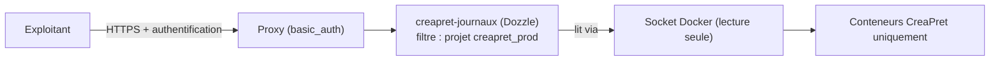

# Réalisation — Consultation des traces d'activité

> Pour un lecteur technique. **Conception correspondante** : `../conception/journaux.md`.

## L'outil et le filtrage

**Dozzle** (service `creapret-journaux`) : consultation des traces depuis une interface, **sans ouvrir
de session sur la machine**. Le filtrage restreint la vue **aux seuls conteneurs de CréaPrêt** :
`DOZZLE_FILTER=label=com.docker.compose.project=creapret_prod`. Les conteneurs de l'autre application
(projet distinct) **n'apparaissent pas**.

## Protection d'accès

L'accès au service passe par le **proxy** (pile CreaSlot) protégé par `basic_auth` : la consultation
est **réservée aux personnes habilitées**, conformément à l'exigence (les traces peuvent contenir des
informations sensibles).

## Compromis de sécurité assumé

L'outil lit les traces via le **socket du démon de conteneurs**. Ce socket donne accès au démon, **donc
au serveur entier** : c'est un compromis. Il est **limité** par un montage en **lecture seule**
(`/var/run/docker.sock:/var/run/docker.sock:ro`) — consultation possible, **aucun contrôle** — et
l'accès au service reste protégé par authentification au niveau du proxy.

## Schéma

## Écarts par rapport à la conception

Conforme aux exigences (accès sans session serveur, vue restreinte à cette application, accès protégé).
Le **compromis** du socket de conteneurs n'était pas explicité dans la conception ; il est ici
**assumé et borné** (lecture seule). Les renoncements (conservation longue, recherche profonde,
corrélation) sont respectés : l'outil ne fait que la consultation récente.
