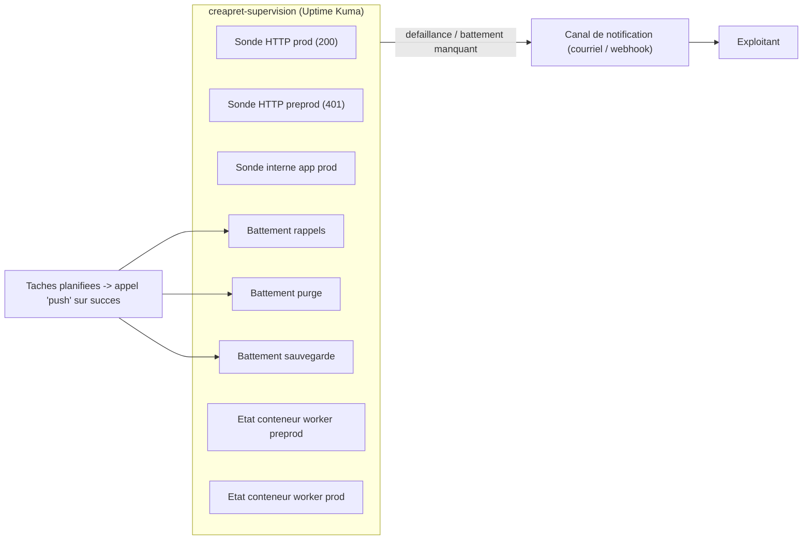

# Réalisation — Surveillance de la disponibilité

> Pour un lecteur technique. **Conception correspondante** : `../conception/surveillance.md`.

## L'outil retenu, et pourquoi

**Uptime Kuma** (service `creapret-supervision`) : léger, auto-hébergeable, il couvre à lui seul les
**trois natures de défaillance** de la conception — sondes de services visibles, **battements**
(*push*) pour les tâches périodiques, et **surveillance de l'état des conteneurs** pour les traitements
internes invisibles de l'extérieur. Instance **dédiée** à CréaPrêt (distincte de celle de l'autre
application).

## Les huit sondes

| # | Sonde | Couvre |
|---|---|---|
| 1 | HTTP `prod.domaine` (code 200) | Service public visible |
| 2 | HTTP `preprod.domaine` (code 401 accepté) | Environnement d'essai + protection d'accès |
| 3 | Sonde interne du service applicatif de production | État de l'application, isolé du proxy |
| 4 | Battement « rappels d'échéance » | Exécution effective de la tâche |
| 5 | Battement « purge du journal » | Exécution effective de la tâche |
| 6 | Battement « sauvegarde » | Exécution effective de la tâche |
| 7 | État du conteneur `creapret-worker-preprod` | Traitement interne invisible de l'extérieur |
| 8 | État du conteneur `creapret-worker-prod` | Traitement interne invisible de l'extérieur |

## Signalement des traitements planifiés

Chaque tâche planifiée notifie un **moniteur *push*** de la supervision **uniquement en cas de succès**
(appel chaîné en `&&`). L'**absence** de battement à l'échéance déclenche l'alerte — c'est ainsi qu'une
tâche **qui ne s'exécute pas** (une absence) est détectée.

## Canal de notification et seuils

- **Canal** : au moins un canal configuré par sonde (courriel via le routeur, ou webhook).
- **Seuils** : expiration du certificat surveillée sur les sondes HTTP (alerte anticipée).

## Vérification et limites

- **Vérification** : couverte au niveau opérationnel — détail dans `../runbook-deploiement.md` §8.
- **Limites** : l'espace disque n'est pas surveillé ; un consommateur **vivant mais bloqué** n'est pas
  détecté (l'état « en cours d'exécution » ne prouve pas le traitement) ; la supervision **ne peut pas
  signaler sa propre panne**.

## Schéma

Les huit sondes et le chemin d'une alerte, avec les composants nommés.

## Écarts par rapport à la conception

La conception exige de détecter les trois natures de défaillance : c'est réalisé. **Réserve** : la
**dernière limite** (la supervision ne s'auto-surveille pas) laisse un angle mort — un contrôle externe
resterait nécessaire pour le couvrir.
