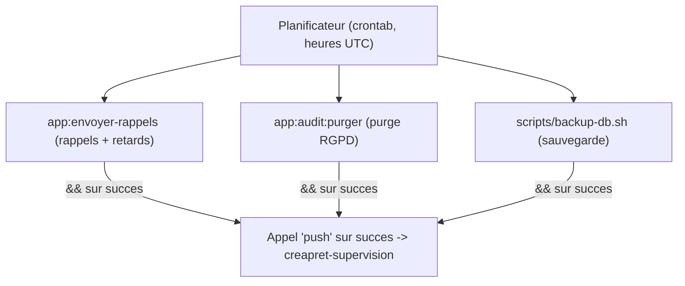

# Réalisation — Traitements automatiques

> Pour un lecteur technique. **Conception correspondante** : `../conception/traitements-automatiques.md`.

## Les trois tâches et leur planification

| Tâche | Commande / script | Planification (UTC) | Équivalent local (Réunion) |
|---|---|---|---|
| Rappels d'échéance et retards | `app:envoyer-rappels` | `0 14 * * *` | 18h00 |
| Purge du journal (RGPD) | `app:audit:purger` | `0 3 1 * *` | 07h00 le 1er du mois |
| Sauvegarde de la base | `scripts/backup-db.sh` | `30 2 * * *` | 06h30 |

Détail des lignes de planification : `../cron-rappels.md`, `../cron-purge-audit.md` ; procédures et
signalement *push* : `../runbook-deploiement.md` §7.

## Garde-fous et contrôle de cohérence

- **Jeu de démonstration confiné à l'endroit prévu** : `scripts/seed-preprod.sql` porte un garde-fou
  qui **échoue réellement** (instruction `SIGNAL`) s'il n'est pas exécuté sur la base de
  **préproduction** — impossible de l'appliquer par erreur ailleurs.
- **Contrôle de cohérence de la restauration** : `scripts/restore-db.sh` exige une confirmation
  explicite et **refuse les croisements d'environnement** (une sauvegarde de préproduction ne peut être
  restaurée dans la base de production, et réciproquement).

## Jeu d'essai réalisé (valeurs réelles)

État initial (jeu de démonstration) : **3 utilisateurs** (un par rôle) et **6 prêts** couvrant tous les
statuts. Vérification du garde-fou de restauration :

| Archive | Base cible | Résultat |
|---|---|---|
| préproduction | production | **refusé** |
| production | préproduction | **refusé** |
| préproduction | préproduction | autorisé |
| production | production | autorisé |
| environnement indéterminable | production | autorisé |

Incident réel traité : une sauvegarde de préproduction restaurée en production (**0 prêt** applicatif
après coup), **détectée**, **corrigée** par restauration de la sauvegarde de production précédente
(retour à **3 utilisateurs / 6 prêts**), puis **garde-fou ajouté**. Détail : `../runbook-deploiement.md`
§6.

## Schéma

## Écarts par rapport à la conception

Conforme : les trois traitements s'exécutent sans intervention, avec confirmation de succès signalée à
la supervision (l'absence de confirmation alerte). L'exigence « une copie non testée n'est pas une
sauvegarde » est **matérialisée** par le contrôle de restauration et le jeu d'essai ci-dessus.
